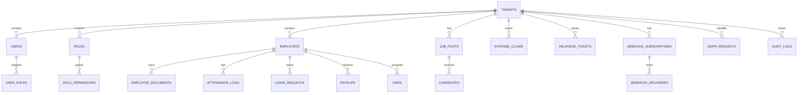

# Database ERD

```mermaid
erDiagram
  TENANTS ||--o{ USERS : contains
  TENANTS ||--o{ ROLES : contains
  USERS ||--o{ USER_ROLES : mapped
  ROLES ||--o{ ROLE_PERMISSIONS : grants

  TENANTS ||--o{ EMPLOYEES : contains
  EMPLOYEES ||--o{ EMPLOYEE_DOCUMENTS : owns
  EMPLOYEES ||--o{ ATTENDANCE_LOGS : has
  EMPLOYEES ||--o{ LEAVE_REQUESTS : raises
  EMPLOYEES ||--o{ PAYSLIPS : receives
  EMPLOYEES ||--o{ OKRS : assigned

  TENANTS ||--o{ JOB_POSTS : has
  JOB_POSTS ||--o{ CANDIDATES : receives

  TENANTS ||--o{ EXPENSE_CLAIMS : tracks
  TENANTS ||--o{ HELPDESK_TICKETS : tracks
  TENANTS ||--o{ WEBHOOK_SUBSCRIPTIONS : has
  WEBHOOK_SUBSCRIPTIONS ||--o{ WEBHOOK_DELIVERIES : emits
  TENANTS ||--o{ GDPR_REQUESTS : handles
  TENANTS ||--o{ AUDIT_LOGS : stores
```
