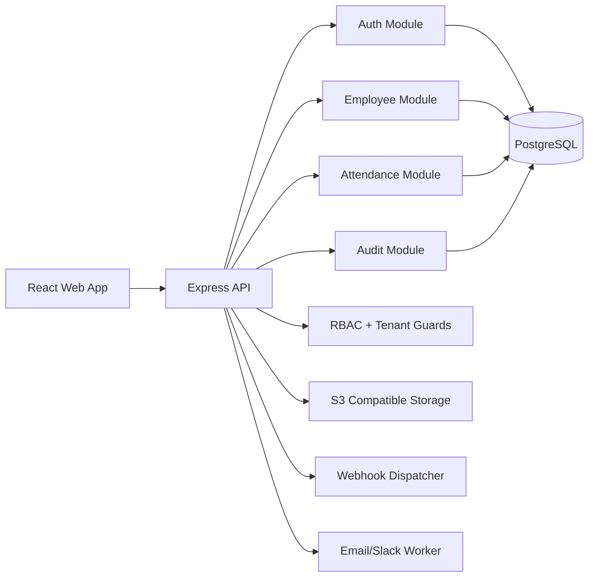

# System Architecture

## SaaS Model
- Multi-tenant by `tenant_id` in all domain tables.
- Role-permission matrix with custom role support.
- API-first endpoints with JWT access tokens.

## Security Controls
- JWT access + refresh flow.
- Per-route permission middleware.
- Audit logs on write operations.
- OAuth Google flow endpoints ready.
